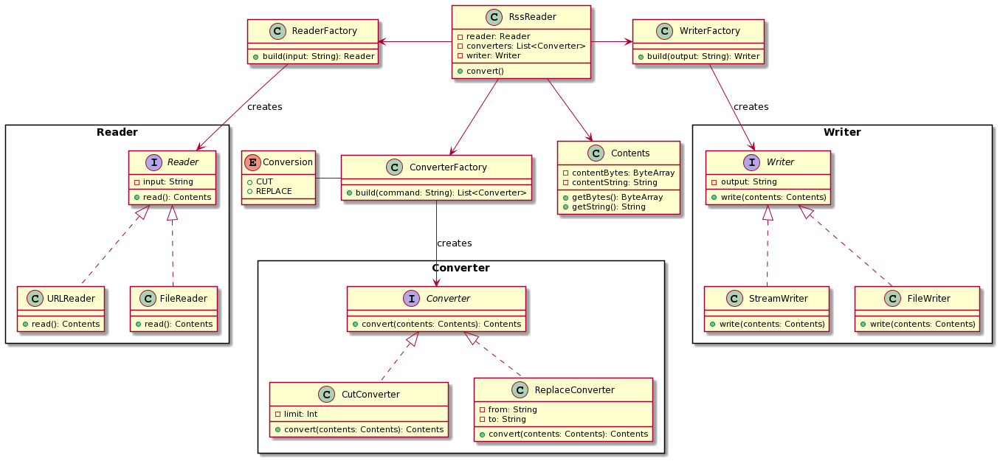

# RSS Reader
This application takes an input, applies conversion commands and outputs the result.

## How to build
```
./gradlew build
```

## How to run
```
java -jar RssReader.jar --input "/input.txt" --convert "cut" --output "/cut.txt"
```
```
java -jar RssReader.jar -i "https://rss.art19.com/apology-line" -c "cut,replace(/a/bbb/)"
```

## Input
| Argument      | Option    | Shorthand | Description                                             |
| ------------- | --------- | --------- | ------------------------------------------------------- |
| Input         | --input   | -i        | RSS URL or file                                         |
| Convert       | --convert | -c        | Comma-separated conversion commands (see details below) |
| Output        | --output  | -o        | Output file path or blank for standard output           |

### Conversion command
1. cut - trims texts with length exceeding 10 characters <br />
e.g. <br />
```java -jar RssReader.jar -i "/input.txt" -c "cut" -o "/cut.txt"``` <br /> 
input.txt contents: "Arbitrary case-insensitive reference text" <br />
output: "Arbitrary case-insen reference text"
2. replace - replaces target string with a replacement string <br />
e.g. <br />
```java -jar RssReader.jar -i "/input.txt" -c "replace(/en/not en/)" -o "/replace.txt"``` <br /> 
input.txt contents: "Arbitrary case-insensitive reference text" <br />
output: "Arbitrary case-insnot ensitive refernot ence text"

## Class Diagram


## Samples
* Cut
```
java -jar RssReader.jar -i "src/test/resources/input.txt" -c "cut" -o "out/cut.txt"
```
[Input file](./src/test/resources/input.txt) <br />
[Output file](./out/cut.txt) <br />
* Replace
```
java -jar RssReader.jar -i "src/test/resources/input.txt" -c "replace(/The Apology Line/REPLACEMENT TEXT/)" -o "out/replace.txt"
```
[Input file](./src/test/resources/input.txt) <br />
[Output file](./out/replace.txt)
